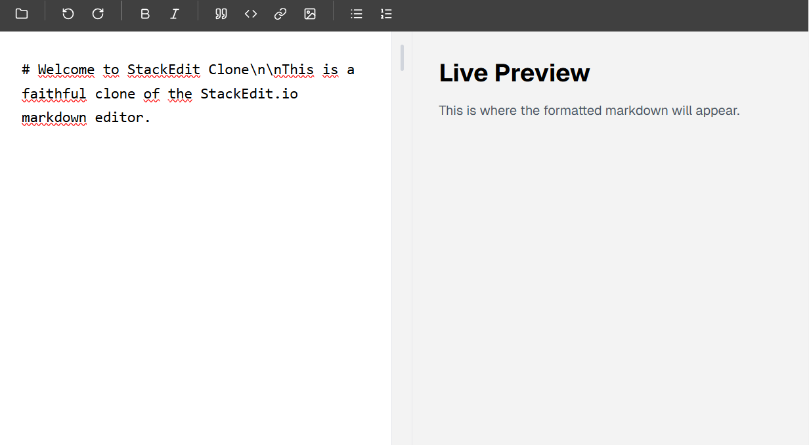

# 📝 StackEdit Clone: Modern Markdown Workspace

## 📝 Descrição do Projeto
O **StackEdit Clone** é uma recriação fiel e moderna do famoso editor de Markdown online. Focado em produtividade e minimalismo, o sistema oferece uma experiência de escrita fluida com uma interface de painel duplo: um editor de texto puro com suporte a Markdown à esquerda e uma visualização renderizada em tempo real à direita.

A interface foi desenhada seguindo os princípios de **Vibecoding**, garantindo que cada componente — desde a barra de ferramentas superior de 44px até o divisor central de 26px — tenha a "vibe" e o espaçamento exatos do StackEdit original, utilizando fontes modernas (Lato) e uma paleta de cores balanceada.

---

*Figura 1: Interface principal com o layout split-screen e barra de ferramentas minimalista.*

## 🚀 Tecnologias Utilizadas
* **Frontend:** React 19 + TypeScript + Vite
* **Estilização:** Tailwind CSS (Arquitetura Utilitária com v4)
* **Componentes:** Shadcn/ui + Lucide React (Ícones)
* **Tipografia:** Google Fonts (Lato)
* **Animações:** Motion (Transições e micro-interações)

## 📊 Funcionalidades e Design
O projeto foi estruturado para fornecer um ambiente de escrita profissional:
* **Real-time Live Preview:** Sincronização instantânea entre o que é digitado no editor e a visualização formatada.
* **Layout Fiel:** Barra superior fixa com alpha de 0.75 e 44px de altura, ícones de formatação estratégica e sidebar de escrita.
* **Componentização Atômica:** Código organizado em componentes pequenos e reutilizáveis para facilitar a manutenção e expansão.
* **Scroll Sincronizado:** (Em desenvolvimento) Movimentação coordenada entre os dois painéis para manter o contexto visual.
* **Estética Minimalista:** Uso rigoroso da paleta #000000, #ffffff e #f3f3f3 para foco total no conteúdo.

## 🔧 Como Executar
1. Clone o repositório.
2. Instale as dependências: `npm install`.
3. Execute o servidor de desenvolvimento: `npm run dev`.
4. Abra `http://localhost:3000` no seu navegador.

[Voltar ao início](https://github.com/LuizGustavo2903/portfolio-luiz-gustavo-caldeira-ribeiro)
